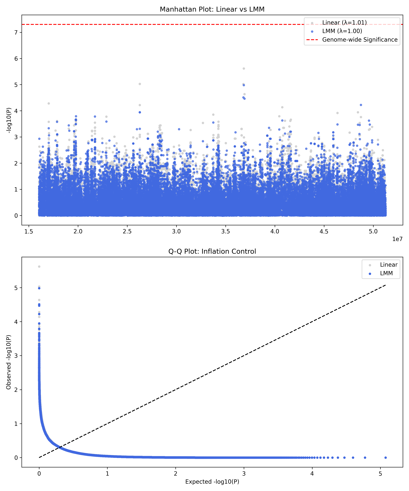

## Project Overview

This repository contains code and scripts for our UCSD CSE284 course project (Option 2: applying two or more methods to a task discussed in class and comparing results on real data). The goal is to perform a Genome-Wide Association Study (GWAS) on real genotype data from the 1000 Genomes Project (Phase 3, CHB, chromosome 22), simulate a quantitative trait under an additive genetic model, and compare two statistical approaches:

- A standard linear regression model using PLINK (baseline):
  Y = Xβ + ε
- A linear mixed model (LMM) using GCTA to incorporate a genetic relationship matrix (GRM):
  Y = Xβ + Zu + ε

The comparison will focus on genomic inflation factor (λ_GC), Manhattan plots, and Q–Q plots, to evaluate how each method handles population structure and related confounding factors.

## Dependencies & Installation

To reproduce this pipeline, the following tools and libraries are required:

* PLINK (v1.9+): Required for basic data processing and standard linear regression GWAS.
* GCTA (v1.9+): Required for generating the Genetic Relationship Matrix (GRM) and running the Linear Mixed Model (MLMA). 
* Python 3: Required for the master execution script and phenotype simulation.
  * Packages: `numpy`, `pandas`
* R / Python: Required for downstream analysis and generating visualization plots (Q-Q and Manhattan plots).

You can run this pipeline seamlessly on JupyterHub by activating a standard conda environment containing `numpy`/`pandas` and ensuring `plink` and `gcta64` are in your `$PATH` or specified via the `GCTA_BIN` environment variable.

## Repository Structure
.
├── README.md                 # Main project documentation
├── run_pipeline_01_05.py     # Master interactive Python driver for steps 01-05
├── scripts/                  # Core bash and python scripts for data prep, QC, and GWAS
├── analysis/                 # Scripts for calculating lambda_GC and plotting
├── data/                     # Directory for genotype (.bed/.bim/.fam) and phenotype files
├── results/                  # Directory for PLINK/GCTA association outputs
│   └── plots/                # Directory for generated Q-Q and Manhattan plots
└── doc/                      # Project report and presentation outlines


## Current Progress (as of 2026-03-02)

The following components of the pipeline have been implemented and tested end-to-end.

+ `scripts/01_prepare_data.sh`: Check for a recent PLINK (>= 1.9) on PATH, download 1000 Genomes Phase 3 chr22 data and sample panel, extract the CHB subset, and convert the chr22 CHB VCF to PLINK binary format (.bed/.bim/.fam).

+ `scripts/02_qc.sh`: Perform basic genotype quality control on the chr22 CHB PLINK dataset (e.g., filters based on minor allele frequency and missingness) and produce a cleaned dataset with prefix like data/chr22_CHB_qc.

+ `scripts/03_make_phenotype.sh`: Based on the QC’ed PLINK dataset, call a Python script (simulate_phenotype.py) to simulate a quantitative trait under an additive genetic model and write phenotype files compatible with PLINK and GCTA.

+ `scripts/simulate_phenotype.py`: Implement the actual phenotype simulation logic on top of the real genotype matrix, controlling how SNP effects are generated and how the quantitative phenotype values are constructed.

+ `scripts/04_run_plink_linear.sh`: Run GWAS using PLINK linear regression (e.g., --linear) with the QC’ed genotypes and simulated phenotype, and output baseline association results such as results/chr22_CHB_plink_linear.assoc.linear.

+ `scripts/05_run_lmm.sh`: Locate the GCTA binary via the GCTA_BIN environment variable or gcta64 on PATH, construct a GRM from the QC’ed genotypes if needed, run LMM/MLMA association with GCTA, and produce results such as results/chr22_CHB_gcta_lmm.mlma.

+ `run_pipeline_01_05.py`: Provide an interactive Python driver that sequentially runs steps 01–05, prints a short description before each step, waits for user confirmation (press Enter) to proceed, handles errors by allowing retry or skip for each step, and summarizes the locations of the key PLINK and GCTA output files at the end.

## Preliminary Results

We evaluated the performance of two different GWAS models—**Standard Linear Regression (PLINK)** and **Linear Mixed Model (LMM/GCTA)**—using simulated phenotypes on 1000 Genomes Phase 3 data (Chr 22, CHB population).

### 1. Statistical Models Compared
To identify genetic variants while controlling for confounding factors, we compared:
* **Linear Regression**: $Y = X\beta + \epsilon$ (Baseline approach)
* **Linear Mixed Model (LMM)**: $Y = X\beta + Zu + \epsilon$ (Accounting for population structure and relatedness)

### 2. Genomic Inflation ($\lambda_{GC}$)
We calculated the genomic inflation factor to assess how well each model controls for population stratification:
$$\lambda_{GC} = \frac{\text{median}(\chi^2_{\text{obs}})}{0.4549}$$

| Method | $\lambda_{GC}$ | Observation |
| :--- | :--- | :--- |
| **Linear (PLINK)** | **1.0125** | Slight inflation observed |
| **LMM (GCTA)** | **1.0004** | Near-perfect control of stratification |

### 3. Comparison Visualization
The following figure was automatically generated using the `analysis/compare_plink_lmm.py` script.



### 4. Interpretation
* **Inflation Control**: The LMM showed better control of inflation compared to standard linear regression, with $\lambda_{GC}$ moving from 1.01 down to 1.00.
* **Q-Q Plot Stability**: As shown in the Q-Q plot, the LMM (blue points) follows the expected null distribution more closely than the linear model (grey points), effectively reducing potential false positives.
* **Manhattan Plot Consistency**: Both models identified consistent peaks, but LMM provided a more statistically rigorous assessment of significance.

## How to Run (Quick Start)

We have provided an interactive master script to run the entire pipeline from Step 01 to Step 05. 

1. Clone the repository and navigate to the root directory.
2. Ensure your environment is set up (activate your conda environment and export `GCTA_BIN` if necessary).
3. Execute the master driver:
```bash
python run_pipeline_01_05.py